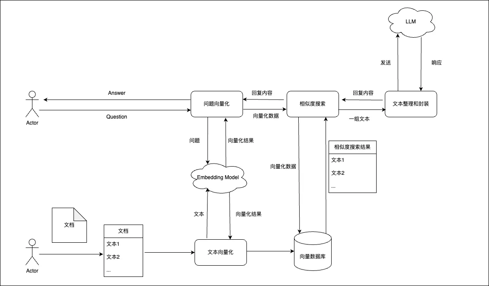

# tomato-llm
- GitHub仓库：https://github.com/spring-projects/spring-ai
- 官方文档：https://spring.io/projects/spring-ai

## 概念

记录一些基本的概念内容。

### 函数调用 TODO

一些大模型中可能集成了函数调用功能，函数调用允许 AI 大模型执行客户端的函数，从而根据需要访问必要的信息或动态地执行任务。

### 流式对话

目前流式对话的实现手段主要有两种：`SSE`和`WebSocket`协议。

- SE是基于Http实现的一种服务端向客户端推送消息的技术，实现较为简单，OpenAI官网采用的是SSE实现的。
- WebSocket则是基于TCP协议实现的全双工通信技术。较为复杂，资源的占用率很高。

Spring AI中流式对话接口采用的是Spring WebFlux异步网络框架实现的，WebFlux底层默认采用Netty。

### 消息类型

1. **`USER("user")`**：
   - 这是用户输入的消息，代表用户向大模型提出的问题、请求或指令。
   - 例如：用户在对话框中输入“天气怎么样？”这种消息会被标记为 `USER`。
2. **`ASSISTANT("assistant")`**：
   - 这是大模型生成的回复或响应消息。通常表示大模型根据用户输入进行分析后，生成的回答。
   - 例如：当用户询问天气时，大模型的回答“今天的天气是晴天”就会被标记为 `ASSISTANT`。
3. **`SYSTEM("system")`**：
   - 这是系统消息，通常由开发者或系统预先定义，用来设定对话规则或约束大模型的行为。
   - 例如：系统可以发送一条指令，告诉大模型“以正式的语气回答问题”或“只提供技术相关的回答”。这种系统级别的消息会被标记为 `SYSTEM`。
4. **`TOOL("tool")`**：
   - 这是工具或函数执行结果的消息，在大模型对话中，当大模型需要调用某个外部工具、API或函数来完成任务时（如查询数据库、计算结果等），这个消息就代表工具的输出。
   - 例如：如果大模型需要查询当前的股票价格，它会调用一个外部API，查询结果会被标记为 `TOOL`。

在大模型对话中，这些类型帮助系统区分不同的消息来源以及处理逻辑，从而确保模型能够正确理解用户输入、生成适当的回复、并根据需要调用外部工具进行操作。

## 向量数据库

目前大模型都有一个Token限制，这个限制你可以理解为传给AI的字符数，当你维护的历史对话越长，突破Token限制的可能性就越高，一旦突破Token限制，AI就无法回复。

再比如，我想让ChatGPT帮我总结一篇30页的论文，必要时还需要让ChatGPT快速帮我解释论文中的概念性名词，这时我们直接将论文内容+问题发给ChatGPT就非常不现实，一方面，这会突破Token限制，另一方面，即使没有突破Token限制，也会产生大量的、没必要的费用开销。那么，我们该如何让ChatGPT帮我们处理超大文本呢？这就需要用到向量数据库了。

针对传统大模型的Token限制，开发者想到了一种解决方案，就是使用向量数据库。向量数据库除了存储必要的元数据(如文本、图片)外，还会存储对应元数据的向量。与传统的数据库执行的精确性搜索不同的是，向量数据库执行的是相似性搜索。执行相似性搜索的算法有很多，比较容易理解的是计算两个向量之间的距离来判断是否相似。目前主流的向量数据库有：[Chroma](https://www.trychroma.com/)、[Milvus](https://milvus.io/)、[Pgvector](https://github.com/pgvector/pgvector)、[Redis](https://redis.io/)、[Neo4j](https://neo4j.com/)；

## RAG技术

向量数据库执行搜索后的结果是一组与用户问题相似的数据，在让AI处理超大文本时，只需将这组数据发送给AI即可，这不仅解决了传入超大文本时突破Token限制，还节省了大量的没必要的开销。而这种方式就是增强检索生成(RAG)。



## ollama

安装：

```bash
cd /opt
curl -fsSL https://ollama.com/install.sh | sh
ollama run qwen2
```

```bash
root@DESKTOP-4R5HHC9:/opt# ollama list
NAME            ID              SIZE    MODIFIED       
qwen2:latest    dd314f039b9d    4.4 GB  45 seconds ago
root@DESKTOP-4R5HHC9:/opt#
```

ollama安装后默认只能本地访问，需要配置远程访问api

```bash
#1.找到服务的单元文件：
#/etc/systemd/system/目录下
sudo vi /etc/systemd/system/ollama.service
 
#2.修改配置文件，分为如下2钟情况 
#情况1：添加环境变量：
[Service]
Environment="OLLAMA_HOST=0.0.0.0:11434"
#情况2：如果已经有
Environment="PATH=xxx:/root/bin" "OLLAMA_HOST=0.0.0.0:11434"
 
#3.为了使更改生效，您需要重新加载systemd的配置。使用以下命令：
sudo systemctl daemon-reload

#4.重启服务以应用更改：
sudo systemctl restart ollama
```

## 代码示例

[tomato-llm-examples](tomato-llm-examples)

- 向量数据库 ChromaDB：[tomato-llm-examples-chroma](tomato-llm-examples/tomato-llm-examples-chroma)
- ollama：[tomato-llm-examples-ollama](tomato-llm-examples/tomato-llm-examples-ollama)
